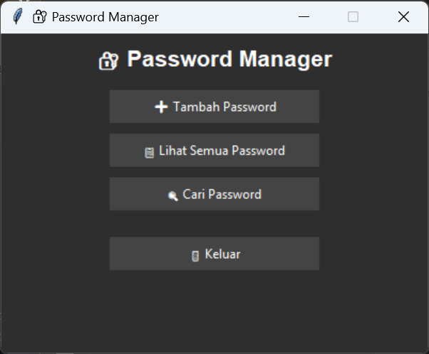

# 🔐 Password Manager GUI dengan Python & Tkinter

Aplikasi sederhana untuk menyimpan dan mengelola password secara lokal menggunakan Python. Dilengkapi tampilan GUI (Tkinter) yang bersih, fitur pencarian, dan mode gelap. Password disimpan secara terenkripsi agar tetap aman.

 <!-- Ganti dengan screenshot buatanmu -->

---

## ✨ Fitur

- ➕ Tambah password baru (situs, username, password)
- 🔍 Cari password berdasarkan nama situs
- 📋 Lihat semua password dalam tampilan tabel
- 🌙 Mode gelap (dark mode)
- 🔒 Enkripsi menggunakan `cryptography (Fernet)`
- 💾 Penyimpanan lokal dalam file JSON

---

## 🚀 Cara Menjalankan

1. **Klon repositori**
```bash
git clone https://github.com/username/password-manager-gui.git
cd password-manager-gui
